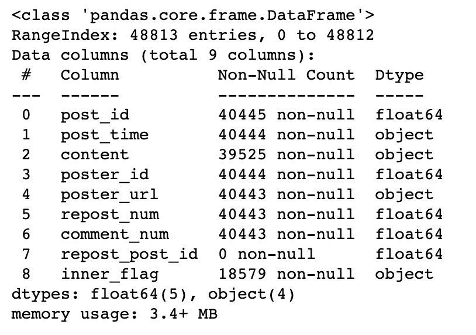
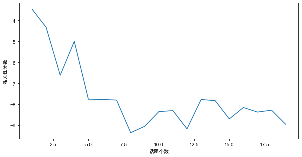

### 作业要求：构建微博数据集的主题模型
-  读入微博数据集的数据
- 清洗
- 除去无汉语的无效数据
  * 滤除句子中的url
  * 对句子进行分词
  * 去停词
- 构造词典
- 用gensim或者sklearn构造主题模型
  * LDA（必做）
  * PLSA/LSA选做
- 数据集要求：选取https://archive.ics.uci.edu/ml/datasets/microblogPCU 网站的微博数据集取user_post的excel中的数据
- 使用哈工大的中文停用词表资源
- 要求
  * 说出你选的主题数
  * 不同主题的高频词
  * 对不同主题，计算TF-IDF高的词
  
#### 作业代码解释
- 根据作业要求逐步进行机器学习操作，模仿老师在PPT里面的代码，将特朗普推特的lda模型迁移到中文微博的模型上
- 1.读入微博数据
    * 导入所有必要的包
        ```python
            from sklearn.feature_extraction.text import CountVectorizer
            from gensim.corpora import Dictionary
            from gensim.models.ldamodel import LdaModel
            from gensim.models import CoherenceModel
            from nltk.corpus import stopwords
            from nltk.tokenize import RegexpTokenizer
            from datetime import datetime
            import nltk
            import numpy as np
            import pandas as pd
            import re
            from matplotlib import gridspec
            import matplotlib.pyplot as plt
            import math
            from ltp import LTP
            from collections import defaultdict
        ```
    * 从微博数据中选取user_post.csv文件作为读取文件
        ```python
            df_user_post = pd.read_csv("user_post.csv") 
        ```
- 2.清洗数据
    * 2.1 滤去无汉语的无效数据
        * 对读取对文件进行拷贝
        ```python
            df_user_post_copy = df_user_post.copy()
        
        ```
    * 通过观察数据的结构，我们发现content列的数据量只有39525，比所有id数目40445要少920个数据，意味着至少有920个数据的微博内容为空
    
     
    
    * 观察数据的具体内容，我们发现content栏的数据中含有大量的非中文字符，如下图所示
    

    * 因此，我们考虑使用正则表达式"r'[^\u4e00-\u9fa5]'"将非汉字的内容剔除掉，从而只保留中文内容
    
        ```python
            df_user_post_content = df_user_post_copy['content']

            pre_processed_content = {'index':df_user_post_content.index, 'content':df_user_post_content.values}

            df_pre_processed_content = pd.DataFrame(pre_processed_content)

            df_pre_processed_content.dropna(inplace=True)

            pattern = re.compile(r'[^\u4e00-\u9fa5]')

            df_pre_processed_content['content'] =[pattern.sub('', x) for x in df_pre_processed_content['content'].tolist()] #为了节省一些内存，事先将微博内容df_pre_processed_content['content']转换为列表，获得部分性能的提升。
        ```

    * 2.2 滤除url内容
      * 事实上，我们通过2.1的操作，已经将所欲的标点符号和英文字符都消除了，其中也包括含有标点符号和英文字符的url，因此这部分的工作已经完成，为了作为练习，我们采用未经2.1操作的数据进行测试
          ```python
            df_user_post_copy2 = df_user_post.copy()
            
            df_user_post_copy2['content']

            df_user_post_content2 = df_user_post_copy2['content']
            pre_processed_content2 = {'index':df_user_post_content2.index, 'content':df_user_post_content2.values}
            df_pre_processed_content2 = pd.DataFrame(pre_processed_content2)

            df_pre_processed_content2.dropna(inplace=True)
          ```
      * 从上面可以看出，原始数据中有5438行数据是含有url信息的，那么我们尝试使用
          ```text
            (https?:\/\/(?:www\.|(?!www))[a-zA-Z0-9][a-zA-Z0-9-]+[a-zA-Z0-9]\.[^\s]{2,}|www\.[a-zA-Z0-9][a-zA-Z0-9-]+[a-zA-Z0-9]\.[^\s]{2,}|https?:\/\/(?:www\.|(?!www))[a-zA-Z0-9]+\.[^\s]{2,}|www\.[a-zA-Z0-9]+\.[^\s]{2,})
          ```
        正则表达式来进行快速清除
          ```python
            pattern2 = re.compile(r'(https?\s+://(?:www.|(?!www))[a-zA-Z0-9][a-zA-Z0-9-]+[a-zA-Z0-9].[^\s]{2,}|www.[a-zA-Z0-9][a-zA-Z0-9-]+[a-zA-Z0-9].[^\s]{2,}|https?://(?:www.|(?!www))[a-zA-Z0-9]+.[^\s]{2,}|www.[a-zA-Z0-9]+.[^\s]{2,})|((http|https):\/\/([\w.]+\/?)\S*)')

            df_pre_processed_content2['content'] =[pattern2.sub('', x) for x in df_pre_processed_content2['content'].tolist()]
          ```

      * 通过以下可以看出，含有url的部分大多可以通过这个pattern2正则表达式去除，但是有两个数据还是有遗留，应该是http后面的“：”错写为中文的冒号导致正则表达式无法匹配这种情形：
      
      * 采用之前只挑选出中文的正则表达式```[^\u4e00-\u9fa5]```是可以把所有的url清除的，如下面所示:
      
      * 2.3 利用LTP给微博内容分词
        * 去停词，采用哈工大、百度、scu合并之后的停用词表，其中content_segment列是初步分词之后的列表结果，content_segment_no_stopwords列是去除停用词的列表结果 
          ```python
              def stopwordslist(filepath):
                  stopwords = [line.strip() for line in open(filepath, 'r', encoding='utf-8').readlines()]
                  return stopwords

              stopwords = stopwordslist('stopwords.txt')
          ```
        * 在实际运行过程中，由于数据框df_pre_processed_content的行数太大，共有39525行，如果对所有content一次性处理，将会导致内存溢出，电脑计算崩溃，因此考虑对dataframe进行数据切片，类似于mini-batch的方法，一次只处理1000行，最多处理40次，然后再将这些处理后的数据框合并起来。
        * 建立一个结合去停词和分词的函数segment_content
          ```python
          ltp = LTP()
          def segment_content(df_content):
            segment, hidden = ltp.seg([x for x in df_content['content'].tolist()])
            df_content.loc[:,'content_segment'] = segment
            df_content.loc[:,'content_segment_no_stopwords'] = df_content['content_segment'].apply(lambda row: [word for word in row if word not in stopwords])
            return df_content   
          ```
        * 建立三个片段的数据框内容,起始数据框df_pre_processed_content_demo, 中间变量数据框f_pre_processed_content_demo2，末尾数据框f_pre_processed_content_demo3，其中起始数据框作为循环的初始化，中间变量作为循环中迭代的中间变量，这两种变量都是1000行，末尾数据框作为最后需要处理的不满1000行的剩余内容。
          ```python
              df_pre_processed_content_demo = df_pre_processed_content.iloc[0:1000]

              result = segment_content(df_pre_processed_content_demo)

              for i in range(38):
                  df_pre_processed_content_demo2 = df_pre_processed_content.iloc[(i+1)*1000:(i+2)*1000]
                  
                  result = result.append(segment_content(df_pre_processed_content_demo2))
              
              df_pre_processed_content_demo3 = df_pre_processed_content.iloc[39000:]
              result = result.append(segment_content(df_pre_processed_content_demo3))
        ```

      * 每个数据框处理后的形式如下：
  
      

- 3.构造词典
  * 建立get_dict函数生成词典
    ```python
      def get_dict(dataframe):
      word_dict =  defaultdict(int)
      word_list = [word for weibo in dataframe.content_segment_no_stopwords for word in weibo]
      for word in word_list:
          word_dict[word] = word_dict.get(word, 0) + 1
      return word_dict
    ```
  * 对每条微博建立一个字典，每个词都有自己独有的ID。 我们拥有39525条微博，以及56021个不同的词(去除停用词之后)。
  * 建立一个词典weibo_corpus，其中每个元素是关于每条微博中所有词语的出现次数
  
    ```python
        weibo_dictionary = Dictionary(result.content_segment_no_stopwords)
        
        weibo_corpus = [weibo_dictionary.doc2bow(weibo) for weibo in result.content_segment_no_stopwords]
    ```

- 4.用gensim构造LDA主题模型
  * 计算相关矩阵，假设主题数目从1到20个，看主题数目设为多少的时候，相关矩阵的得分最低，这也就表明这个主题数目设着的最为合适，各个主题之间的区分度最高
  
    ```python
        plt.rcParams['font.sans-serif'] = ['Arial Unicode MS']  #  添加设置，使得可以显示中文字体
        weibo_coherence =[]
        for nb_topics in range(1, 20):
            lda = LdaModel(weibo_corpus, num_topics = nb_topics, id2word = weibo_dictionary, passes = 10)
            cohm = CoherenceModel(model=lda, corpus=weibo_corpus, dictionary=weibo_dictionary, coherence='u_mass')
            coh = cohm.get_coherence()
            weibo_coherence.append(coh)
        plt.figure(figsize=(10,5))
        plt.plot(range(1, 20), weibo_coherence)
        plt.xlabel("话题个数")
        plt.ylabel("相关性分数")
    ```
  * 通过以下的话题个数-相关性分数的可视化曲线图可以估计最少的话题数量为8个。
    
  
    ```python
        k = 8
        weibo_lda = LdaModel(weibo_corpus, num_topics=k, id2word=weibo_dictionary, passes=10)

        def plot_top_words(lda=weibo_lda, nb_topics = k, nb_words=10):
            top_words = [[word for word, _ in lda.show_topic(topic_id, topn=50)] for topic_id in range(lda.num_topics)]
            top_betas = [[beta for _, beta in lda.show_topic(topic_id, topn=50)] for topic_id in range(lda.num_topics)]
            gs = gridspec.GridSpec(round(math.sqrt(k))+1, round(math.sqrt(k))+1)
            gs.update(wspace=0.5, hspace=0.5)
            plt.figure(figsize=(20, 15))
            for i in range(nb_topics):
                ax = plt.subplot(gs[i])
                plt.barh(range(nb_words), top_betas[i][:nb_words], align='center', color='blue', ecolor='black')
                ax.invert_yaxis()
                ax.set_yticks(range(nb_words))
                ax.set_yticklabels(top_words[i][:nb_words])
                plt.title("Topic "+str(i))

        plot_top_words()
    ```
  * 通过下面的图，可以大致判断出Topic0为体育健身类，Topic1为时间类，Topic2为都市生活娱乐类，Topic3为财商类，Topic4为新闻类，Topic5为家庭类，Topic6为汽车市场类，Topic7为政治体育类，这些类仅仅通过前10词还是不好直接判断，大体上能够把所有的微博方向分析成8个话题种类。
  
  

  
